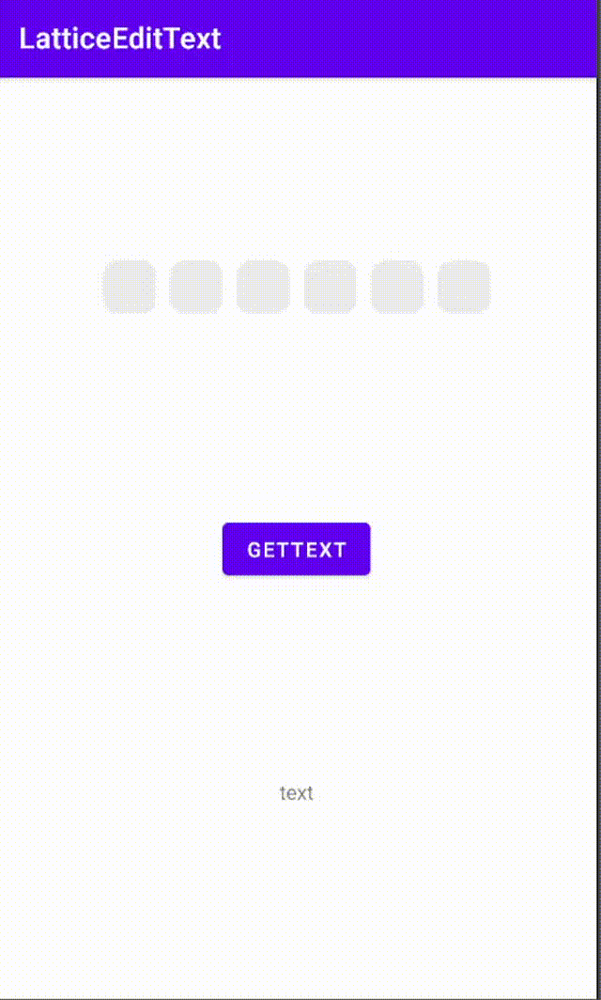

# LatticeEditText

[](https://jitpack.io/#viifo/LatticeEditText)

[中文](https://gitee.com/viifo/LatticeEditText/blob/master/README.md) | [English](https://gitee.com/viifo/LatticeEditText/blob/master/README_en.md)

一个格子输入框，可用于验证码或密码输入。


## 预览

|           box模式           |          box模式        |
|:-------------------------:|:---------------------:|
|  |  |
|        **box无边框**         |    **字符回显**     |
|  |  |
|        **line模式**         |       **line模式**      |
|  |  |
|        **自动切换焦点**         |                       |
|  |                       |


## 依赖
1.  在根目录下的 build.gradle 文件中的 repositories 下添加：
```groovy
allprojects {
    repositories {
        ...
        maven { url 'https://jitpack.io' }
    }
}
```
2.  添加依赖
```groovy
dependencies {
    implementation 'com.github.viifo:LatticeEditText:1.0.4'
}
```


## 使用
1.  在 XML 中添加：
```xml
<com.viifo.latticeedittext.LatticeEditText
        android:id="@+id/et_input"
        android:layout_width="wrap_content"
        android:layout_height="wrap_content"
        android:padding="0dp"
        android:layout_margin="5dp"
        android:textSize="18sp"
        android:textColor="#ff0000"
        app:border_radius="10dp"
        app:cursor_height="15dp"
        app:cursor_color="#ff0000"
        app:size="4"
        app:input_mode="box"
        android:background="#ececec"
        app:border_color="#ff00ff"/>
```
2.  文本改变监听：
```java
// kotlin
latticeEditText.textChangeListener = { 
    println("--> OnTextChangeListener： text = $it")
}
// or
latticeEditText.setOnTextChangeListener {
    println("--> OnTextChangeListener： text = $it")
}

// java
latticeEditText.setOnTextChangeListener(new OnTextChangeListener() {
    @Override
    public void onTextChange(@Nullable String text) {
        System.out.println("--> OnTextChangeListener： text = " + text);
    }
});
```


## 属性表

|            name             |  format   |                 description                  |
|:---------------------------:|:---------:|:--------------------------------------------:|
|     android:background      |   color   |                     背景色                      |
|       android:content       |  string   |                    输入框内容                     |
|    android:layout_margin    | dimension |                     外边距                      |
|  android:layout_marginLeft  | dimension |                     左外边距                     |
|  android:layout_marginTop   | dimension |                     上外边距                     |
| android:layout_marginRight  | dimension |                     右外边距                     |
| android:layout_marginBottom | dimension |                     下外边距                     |
|          text_size          | dimension |                     文字大小                     |
|         text_color          |   color   |                     文字颜色                     |
|         input_mode          |   enum    |                输入框样式，参考输入框样式表                |
|            size             |  integer  |                    输入框个数                     |
|         input_width         | dimension |                   单个输入框宽度                    |
|        input_height         | dimension |                   单个输入框高度                    |
|        border_radius        | dimension |                     边框半径                     |
|        border_width         | dimension |                     边框宽度                     |
|        border_color         |   color   |                     边框颜色                     |
|        replace_text         |  string   |                     回显字符                     |
|         cursor_mode         |   enum    |                 光标样式，参考光标样式表                 |
|         show_cursor         |  boolean  |                是否显示光标，默认true                 |
|        cursor_width         | dimension |                     光标宽度                     |
|        cursor_height        | dimension |             光标高度，光标模式为 line 时有效              |
|        cursor_color         |   color   |                     光标颜色                     |
|      cursor_background      |   color   |                    光标背景色                     |
|     cursor_orientation      |   enum    | 光标模式为 line 时有效, horizontal - 0, vertical = 1 |
> 注：当 cursor_orientation = horizontal 时，必须满足 input_mode = line & cursor_mode = line


## 输入框样式表
|   name   |  description  |
| :------: | :-----------: |
| box      | 盒子模式       |
| line     | 下划线模式     |


## 光标样式表

|   name   | description |
| :------: |:-----------:|
| box      |    盒子模式     |
| line     |  下划线或竖线模式   |


## 更新日志

* 1.0.4
  1. bug 修复：输入完成后回删光标显示异常。
* 1.0.3
  1. bug 修复。
  2. 竖直闪烁光标实现优化。
  3. 开放部分方法，便于联动自定义键盘。
* 1.0.2
  1. bug 修复。
  2. 新增光标模式。
* 1.0.0


## License

```
Copyright 2021 viifo

Licensed under the Apache License, Version 2.0 (the "License");
you may not use this file except in compliance with the License.
You may obtain a copy of the License at

   http://www.apache.org/licenses/LICENSE-2.0

Unless required by applicable law or agreed to in writing, software
distributed under the License is distributed on an "AS IS" BASIS,
WITHOUT WARRANTIES OR CONDITIONS OF ANY KIND, either express or implied.
See the License for the specific language governing permissions and
limitations under the License.
```

