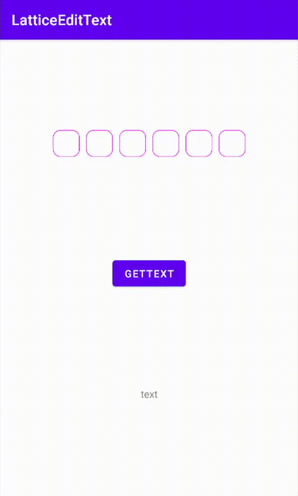
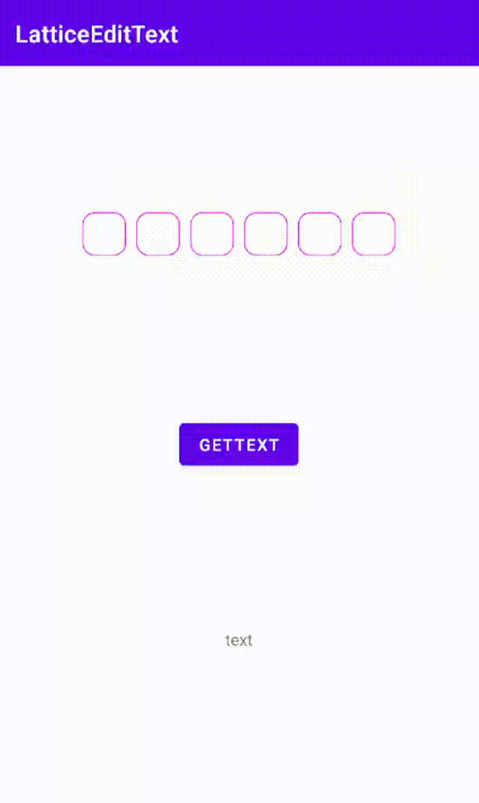
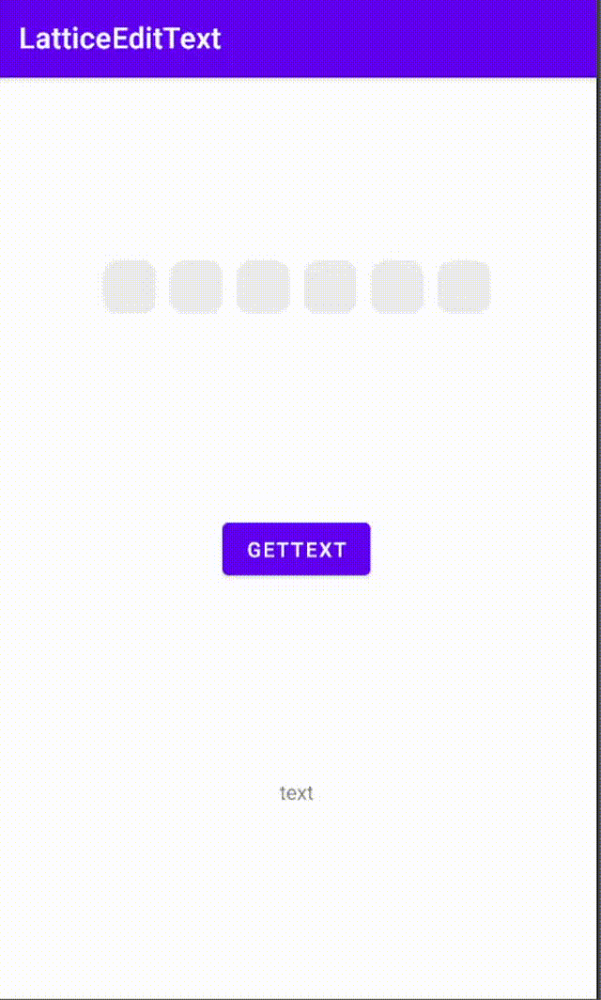
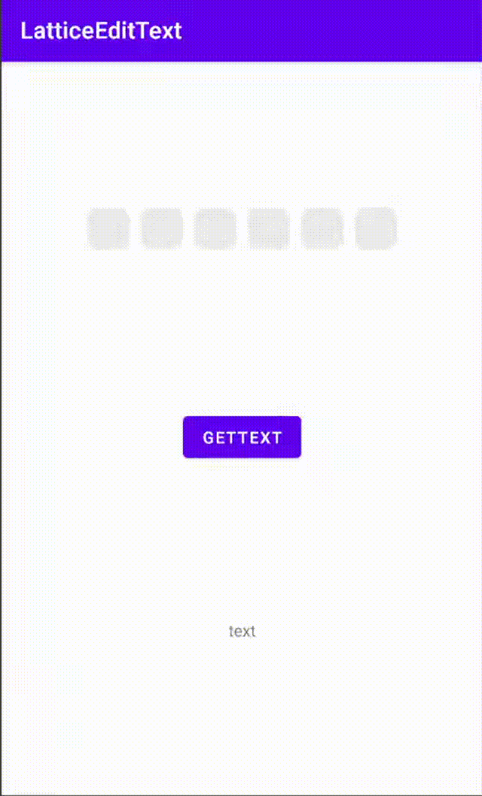

# LatticeEditText

[](https://jitpack.io/#viifo/LatticeEditText)

[中文](https://github.com/viifo/LatticeEditText/blob/master/README.md) | [English](https://github.com/viifo/LatticeEditText/blob/master/README_en.md)

A lattice input box can be used for verification code or password input.


## Preview
| box mode | line mode |
| :--: | :----: |
|  |  |
| **box mode with borderless** | **character echo** |
|  |  |


## Gradle
1.  Add it in your root build.gradle at the end of repositories：
```groovy
allprojects {
    repositories {
        ...
        maven { url 'https://jitpack.io' }
    }
}
```
2.  Add the dependency:
```groovy
dependencies {
    implementation 'com.github.viifo:LatticeEditText:1.0.0'
}
```


## Usage
1. Add in XML:
```xml
<com.viifo.latticeedittext.LatticeEditText
        android:id="@+id/et_input"
        android:layout_width="wrap_content"
        android:layout_height="wrap_content"
        android:padding="0dp"
        android:layout_margin="5dp"
        android:textSize="18sp"
        android:textColor="#ff0000"
        app:border_radius="10dp"
        app:cursor_height="15dp"
        app:cursor_color="#ff0000"
        app:size="4"
        app:input_mode="box"
        android:background="#ececec"
        app:border_color="#ff00ff"/>
```
2. Text change listener:
```java
// kotlin
latticeEditText.textChangeListener = { 
    println("--> OnTextChangeListener： text = $it")
}
// or
latticeEditText.setOnTextChangeListener {
    println("--> OnTextChangeListener： text = $it")
}

// java
latticeEditText.setOnTextChangeListener(new OnTextChangeListener() {
    @Override
    public void onTextChange(@Nullable String text) {
        System.out.println("--> OnTextChangeListener： text = " + text);
    }
});
```


## Attributes

|             name           |  format   |  description  |
| :------------------------: | :-------: | :-----------: |
| android:background         | color     | background color |
| android:textSize           | dimension | text size     |
| android:textColor          | color     | text color    |
| android:text               | string    | text          |
| android:layout_margin      | dimension | margin        |
| android:layout_marginLeft  | dimension | margin left   |
| android:layout_marginTop   | dimension | margin top    |
| android:layout_marginRight | dimension | margin right  |
| android:layout_marginBottom| dimension | margin bottom |
| android:padding            | dimension | padding       |
| android:paddingLeft        | dimension | padding left  |
| android:paddingTop         | dimension | padding top   |
| input_mode                 | enum      | reference input box style sheet |
| size                       | integer   | number of input boxes |
| input_width                | dimension | single input box width |
| input_height               | dimension | single input box height |
| border_radius              | dimension | border radius |
| border_width               | dimension | border width  |
| border_color               | color     | border color  |
| cursor_width               | dimension | cursor width      |
| cursor_height              | dimension | cursor height      |
| cursor_color               | color     | cursor color      |
| replace_text               | string    | used to replace input characters |


## Input mode style
|   name   |  description   |
| :------: | :------------: |
| box      | box mode       |
| line     | underline mode |


## License

```
Copyright 2021 viifo

Licensed under the Apache License, Version 2.0 (the "License");
you may not use this file except in compliance with the License.
You may obtain a copy of the License at

   http://www.apache.org/licenses/LICENSE-2.0

Unless required by applicable law or agreed to in writing, software
distributed under the License is distributed on an "AS IS" BASIS,
WITHOUT WARRANTIES OR CONDITIONS OF ANY KIND, either express or implied.
See the License for the specific language governing permissions and
limitations under the License.
```

